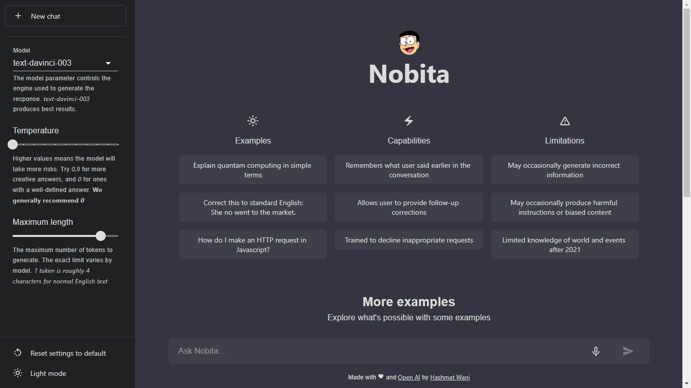
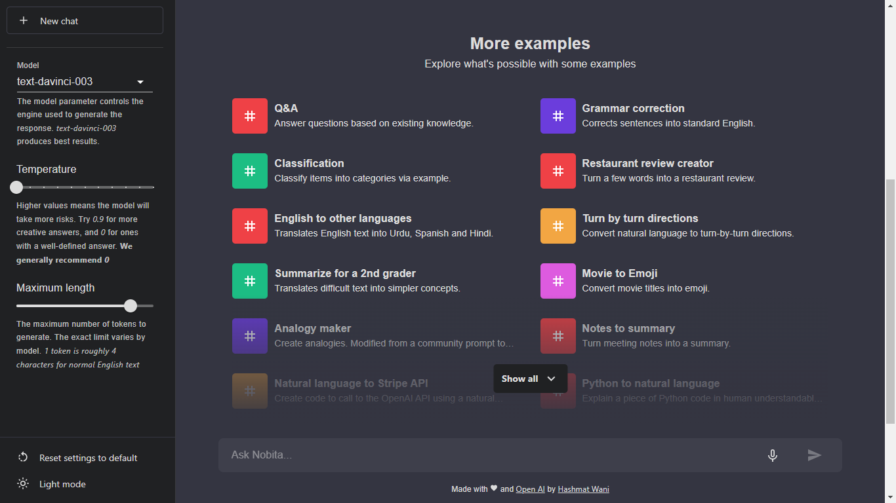
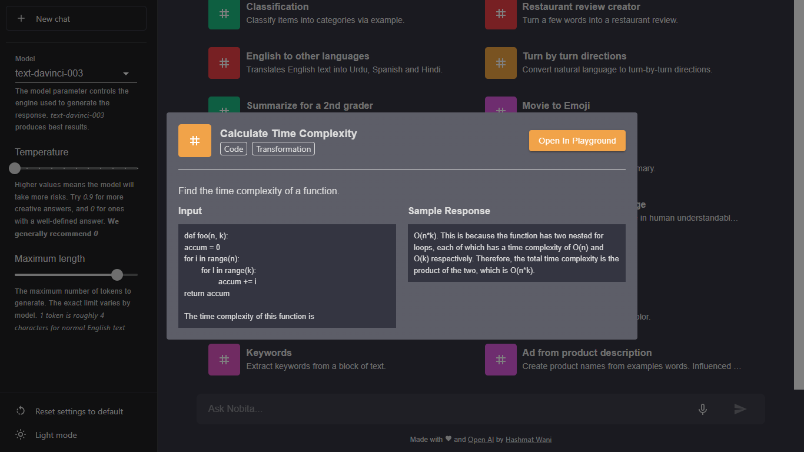
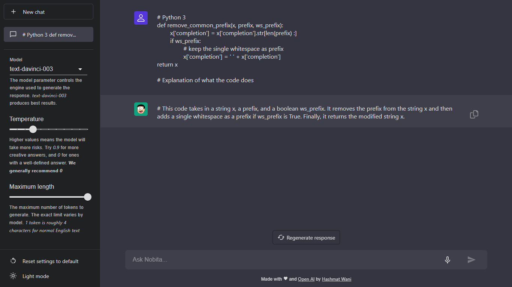
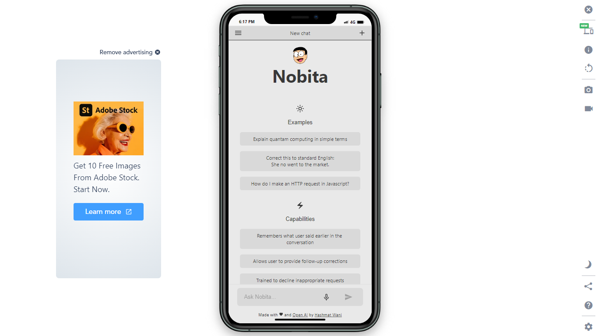
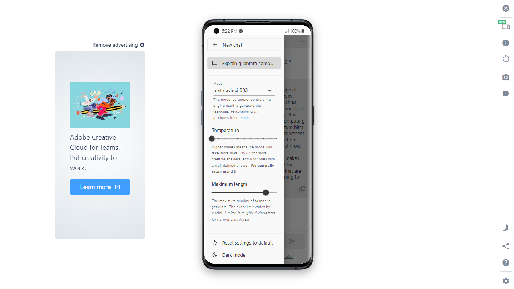
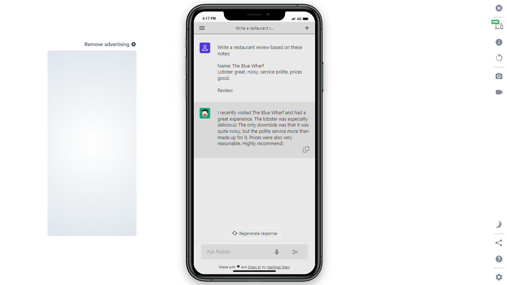

Nobita(chatbot) is a ChatGPT playground that interacts in a conversational way. In this application:

- While generating the response, the User can stop the response. And then it can be regenerated again with the same button.
- User can also copy the response after its generated.
- Speech Recognition is implemented in the app.
- User can toggle between Dark and light mode theme.
- User can change the Model/Engine, Temperature, or Maximum Length to get different responses:
  - **Model:** The model parameter controls the engine used to generate the response. _text-davinci-003_ produces the best results.
  - **Temperature:** Higher values means the model will take more risks. Try _0.9_ for more creative responses, and _0_ for ones with a well-defined response. We generally recommend _0_
  - **MaximumLength:** The maximum number of tokens to generate. The exact limit varies by model. _1_ token is roughly _4_ characters for normal English text

# Desktop View

## Home Page

## Examples

## Dialogue Box

## Chat Container

# Mobile View

